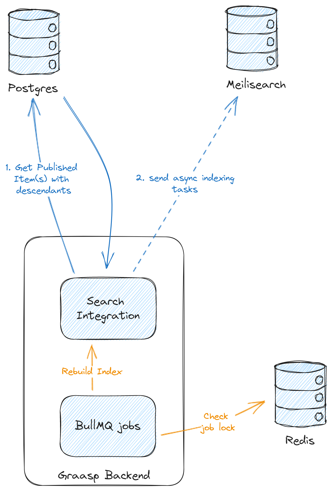

# Introduction
Meilisearch serves as our full-text search index for published items in Graasp, visible in the Library's main search bar and during collection browsing and filtering.

# Key Features of Meilisearch
- **Search as You Type:** Provides instant search results as users type their query.
- **Typo Tolerance:** Handles typographical errors gracefully, enhancing the search experience.
- **Highlighting:** Highlights search terms in the results, making it easier for users to identify relevant information.
- **Faceting:** Allows users to filter search results based on various facets or attributes.

# Data Synchronization
The search index content is asynchronously created from our main database. While changes might not be immediately reflected (making it *eventually consistent*), the index can always be completely rebuilt from the database, ensuring its statelessness.

# Architecture

Meilisearch is managed by the backend, utilizing **[BullMQ](https://docs.bullmq.io/**)** for recurrent job execution and **Redis** for job state storage and locking. Currently, the only background job running is the "rebuild index" task, which scans the entire database to recreate the index. This ensures retrieval of data missed by live indexing hooks.

# Code Organization
## Indexing Logic
The logic for indexing is primarily housed in the `graasp/src/services/item/plugins/published/plugins/search` directory.
  
## Modules
- **`meilisearch.ts`:** Abstracts Meilisearch usage for the rest of the application, managing the indexing logic.
- **`service.ts`:** Handles search queries and sets up hooks for Postgres-Meilisearch synchronization.

# Real-time Data Addition
When creating or updating a published `Item`, it must be added to the index along with its children. To add new data to the index, follow these steps:
1. Update the `IndexItem` type in the SDK.
2. Modify the `parseItem` function in `meilisearch.ts` (essentially a `Mapper<Item, IndexItem>`).
3. Add hooks in `service.ts` for "real-time" synchronization.

# Considerations
- **Non-Relational Nature:** Unlike Postgres, Meilisearch doesn't follow a relational model. When adding data from a foreign key to the index, manual handling of updates is necessary. This includes adding hooks to index items when foreign key data is updated.
