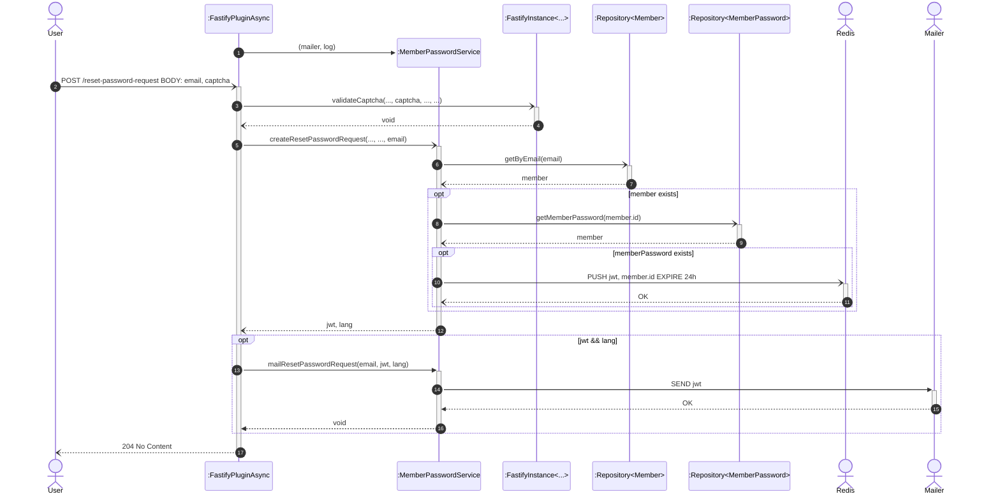
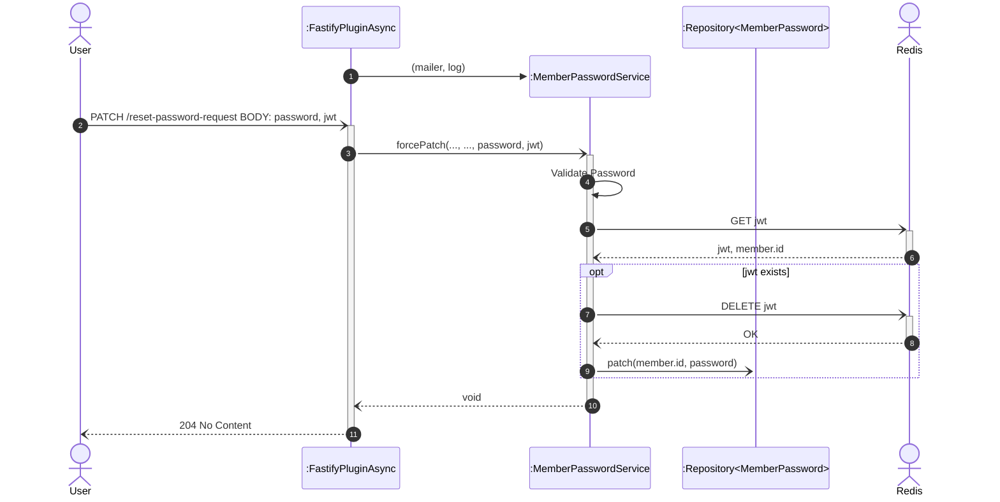

# Reset Password

## POST /ask-reset-password

```mermaid
sequenceDiagram
    autonumber
    actor usr as User
    participant ctrl as :FastifyPluginAsync
    create participant service as :MemberPasswordService
    ctrl->>service: (mailer, log)
    participant fastify as :FastifyInstance<...>
    participant repoMember as :Repository<Member>
    participant repoPass as :Repository<MemberPassword>
    actor redis as Redis
    actor mailer as Mailer

    usr-)+ctrl: POST /reset-password-request BODY: email, captcha
        ctrl-)+fastify: validateCaptcha(..., captcha, ..., ...)
        fastify--)-ctrl: void
        ctrl-)+service: createResetPasswordRequest(..., ..., email)
            service-)+repoMember: getByEmail(email)
            repoMember--)-service: member
            opt member exists
                service-)+repoPass: getMemberPassword(member.id)
                repoPass--)-service: member
                opt memberPassword exists
                    service-)+redis: PUSH jwt, member.id EXPIRE 24h
                    redis--)-service: OK
                end
            end
        service--)-ctrl: jwt, lang
        opt jwt && lang
            ctrl->>+service: mailResetPasswordRequest(email, jwt, lang)
                service->>+mailer: SEND jwt
                mailer-->>-service: OK
            service-->>-ctrl: void
        end
    ctrl--)-usr: 204 No Content
```

## PATCH /set-password

```mermaid
sequenceDiagram
    autonumber
    actor usr as User
    participant ctrl as :FastifyPluginAsync
    create participant service as :MemberPasswordService
    ctrl->>service: (mailer, log)
    participant repoPass as :Repository<MemberPassword>
    actor redis as Redis
    usr-)+ctrl: PATCH /reset-password-request BODY: password, jwt
        ctrl-)+service: forcePatch(..., ..., password, jwt)
            service->>service: Validate Password

            service-)+redis: GET jwt
            redis--)-service: jwt, member.id
            opt jwt exists
                service-)+redis: DELETE jwt
                redis--)-service: OK

                service-)+repoPass: patch(member.id, password)
            end
        service--)-ctrl: void
    ctrl--)-usr: 204 No Content
```
