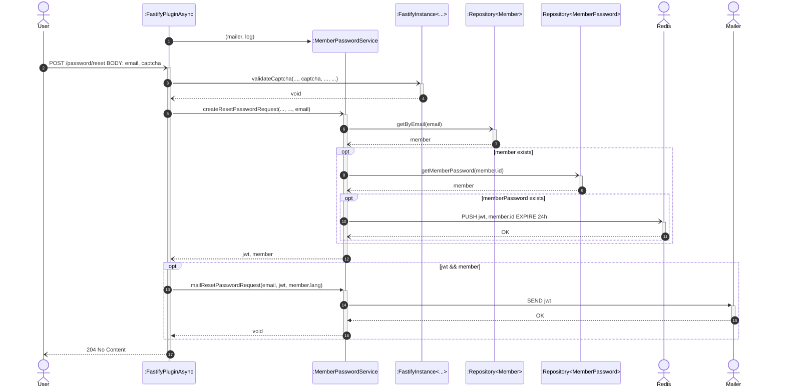
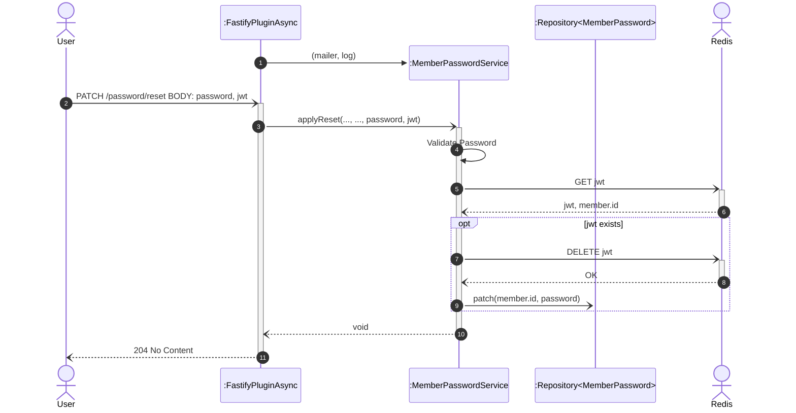

# Reset Password

## POST /password/reset

**Sequence Diagram of request to reset a user password**

A user can request to reset their password by providing their email and a captcha.
The captcha is validated by a decorated function in the Fastify instance. If the captcha is invalid, the request end of the request is handled by the function.

The request is then passed to the `MemberPasswordService` to create a reset password request. If a member with the provided email exists, the service will fetch the member password by member id. If both the member and the member password exist, the service will generate a JWT token and store it in Redis. After that, the service will return the JWT token and the member object to the controller.

If the JWT token and the member object are returned, indicating that the member exists and has a defined password, the controller will request the service to send an email to the member containing the JWT token.

The controller always returns a 204 No Content response at the end of the request. This ensures that even if the member doesn't exist, hasn't set a password, or if the email is not sent, no information about the member is leaked.

## PATCH /password/reset

**Sequence Diagram of completing the password reset**

After receiving the mail, the user can reset their password by providing a new password and the JWT token received in the email. The controller will pass the request to the `MemberPasswordService` to set the password. The service will validate the password and then fetch the JWT token from Redis. If the JWT token exists, the service will delete the token from Redis and patch the member password with the new password.

Again, the controller will return a 204 No Content response at the end of the request. This ensures that even if the JWT token doesn't exist, the password is not set, or the token is not deleted, no information about the member is leaked.
