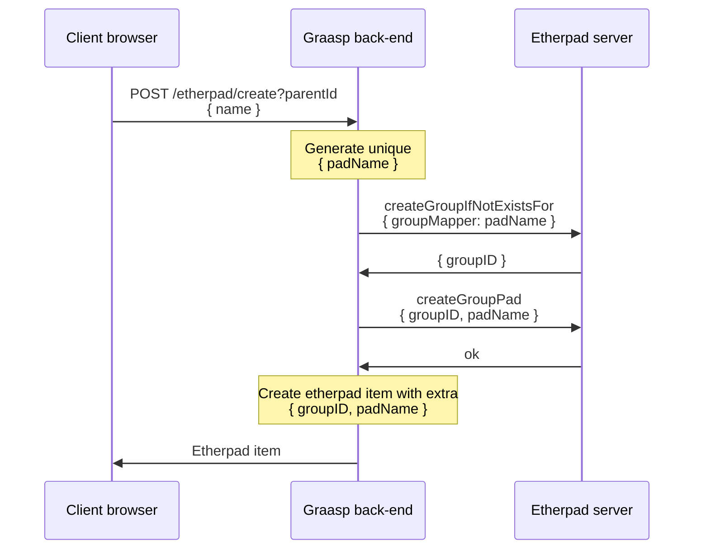
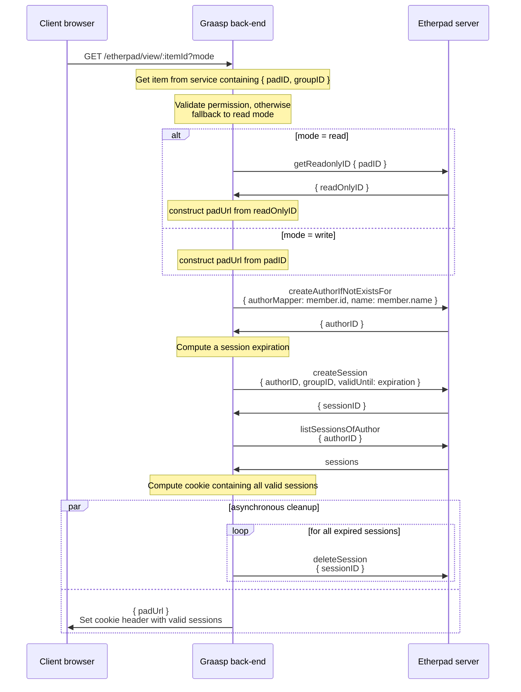

# graasp-plugin-etherpad

This Fastify plugin implements the glue between the Etherpad external service and the Graasp platform. It exposes endpoints to manage Etherpad items in the Graasp object model, and provides authorization mapping between the permissions in Graasp to those in Etherpad.

The plugin communicates with the Etherpad server through the [HTTP API](https://etherpad.org/doc/v1.8.18/#index_http-api). You may find the [Etherpad documentation](https://etherpad.org/doc/v1.8.18/) useful as well.

We use our fork of the `etherpad-api` library at https://github.com/graasp/etherpad-api to facilitate the usage of the HTTP API in Typescript.

## Prerequisites

An instance of the Etherpad (lite) server should be available on the network to this plugin. The list of options to connect to it is available [here](types.ts).

#### A note on the Etherpad server API key

Note that the API key must be placed in the root folder of the Etherpad server deployment, see the related [documentation](https://etherpad.org/doc/v1.8.18/#index_authentication):

> Authentication works via a token that is sent with each request as a post parameter. There is a single token per Etherpad deployment. This token will be random string, generated by Etherpad at the first start. It will be saved in APIKEY.txt in the root folder of Etherpad. Only Etherpad and the requesting application knows this key. Token management will not be exposed through this API.

The key format must be a hex string of 64 characters (i.e. regex `[a-f\d]{64}`).

In the Graasp devcontainer, the key is bind-mounted from [this file](../../../../../.devcontainer/etherpad/devApiKey.txt) and the container is already available over the virtual network from the [docker-compose definition](../../../../../.devcontainer/docker-compose.yml).

In a production container environment, you should either bind-mount a secret key, or build your own etherpad image using the `etherpad/etherpad` image as base and write your own secret file, see the [Dockerfile](Dockerfile) as an example.

> Note: if you update the version of Etherpad, make sure that all relevant documentation is updated as well (e.g. search for `1.8.18` in the entire codebase).

## Permissions mapping

We need to map the Graasp permissions to Etherpad constructs. In Graasp, we represent each Etherpad by a corresponding Etherpad item.

### Builder mode

In the Builder view, the permissions should follow the user membership on the item. Note the special case when an item is public and the user is not logged in, it should still be readable.

> Header row: item visibility, first column: user permission

|            | private   |  public   |
| ---------- | --------- | --------- |
| logged out | none      | read pad  |
| read       | read pad  | read pad  |
| write      | write pad | write pad |
| admin      | write pad | write pad |

Note that the ability "read pad" should also enforce that a user **cannot** edit the pad, e.g. by manually constructing an URL.

> Depending on user needs, it may be interesting to set that public pads (i.e. which item is public) are always writable in Builder, even for logged out users and users that only have a read permission

### Player mode

In the Player view, the pad is (currently) always shown in read-only mode. This may be subject to change in the future, depending on user needs, in which case the mapping should be carefuly redesigned not to leak editable pads to unauthorized users.

> Header row: item visibility, first column: user permission

|            | private  |  public  |
| ---------- | -------- | -------- |
| logged out | read pad | read pad |
| read       | read pad | read pad |
| write      | read pad | read pad |
| admin      | read pad | read pad |

Etherpad exposes the following constructs to manage access to pads:

#### Environment variables

- [`REQUIRE_SESSION`](https://etherpad.org/doc/v1.8.18/#index_advanced):

  > If this option is enabled, a user must have a session to access pads. This effectively allows only group pads to be accessed.

  Note that we **cannot** use this option because we still want some pads to be publicly accessible (public etherpad items should still be at least readable to anyone, including logged out users).

- [`EDIT_ONLY`](https://etherpad.org/doc/v1.8.18/#index_advanced):

  > Users may edit pads but not create new ones. Pad creation is only via the API. This applies both to group pads and regular pads.

  We enable this option since it ensures that only the Graasp server will perform pad management

#### Groups and sessions

> Please read the following sections of the Etherpad documentation:
>
> - [Overview](https://etherpad.org/doc/v1.8.18/#index_overview)
> - [Data types](https://etherpad.org/doc/v1.8.18/#index_data-types)
> - [Groups](https://etherpad.org/doc/v1.8.18/#index_groups)
> - [Authors](https://etherpad.org/doc/v1.8.18/#index_author)
> - [Sessions](https://etherpad.org/doc/v1.8.18/#index_session)
> - [Pads](https://etherpad.org/doc/v1.8.18/#index_pad)
> - [Cookies](https://etherpad.org/doc/v1.8.18/#index_cookies)

Since the granularity of permissions in Graasp is at the item level, we map permissions as follows:

- Each Etherpad item in Graasp is mapped to an Etherpad group (the `groupMapper` is assigned a unique random identifier) which will contain a single pad.
- Each Graasp member which accesses to an Etherpad item is assigned an Etherpad author (the `authorMapper` is assigned the member id)
- Sessions are hence allocated between authors and groups, effectively mapping Graasp members to Graasp Etherpad items.
- In Etherpad, permission is represented by a session (which is stored in a single cookie) **as well as the `padID`**. A user may be given the actual ` padID` with the session, which effectively grants him write permissions on the pad, or a special `readOnlyID` for a given `padID` which only grants read permissions. **It is up to the Graasp back-end and front-ends to never expose both to unpriviliged users**, i.e. a user which does not have at least write permission should _never_ see the actual `padID`.

## Sequence diagrams

> Note: if you're reading this file from VSCode, we recommend installing the [Markdown Preview Mermaid Support](https://marketplace.visualstudio.com/items?itemName=bierner.markdown-mermaid) extension and opening the [Markdown Preview view](https://code.visualstudio.com/docs/languages/markdown#_markdown-preview).

The following operations are implemented on endpoints:

### Create etherpad item

### View an etherpad

> **Note about the session cookie**
