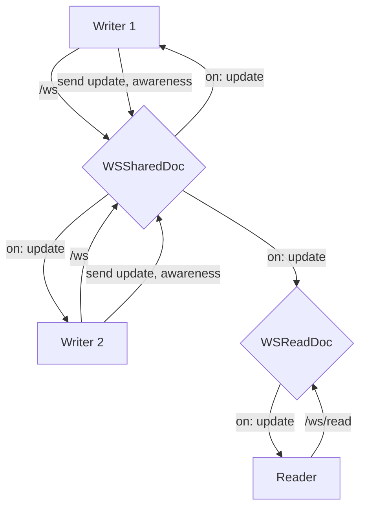
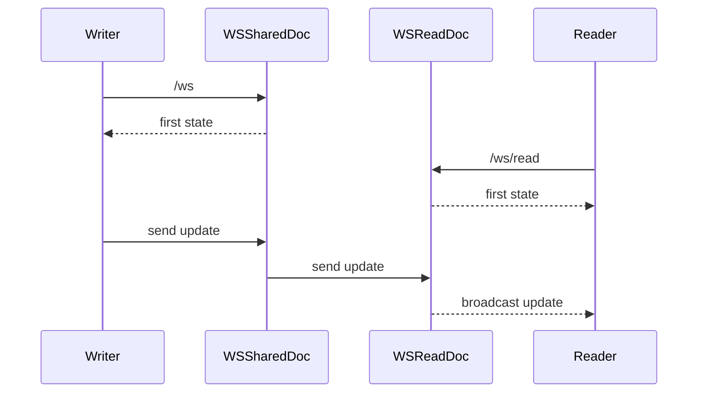

# Pages

## Collaboration

Collaboration is handled by [yjs.js](https://docs.yjs.dev/).

The server files take their sources from this [example repository](https://github.com/yjs/y-websocket-server/).

The yjs's updates are saved in `page_update` and merged (given an update count threshold) to prevent storing too much data.

`page_update` is agnostic of the data `update` it contains.

### Permission Levels

There are 2 websockets connection endpoints:

- `items/pages/:id/ws/read`: For read access, the websocket allows to receive updates for this page. It can be connected to if signed out and the item is public. It does not handle awareness.
- `items/pages/:id/ws`: For write access, the websocket allows to receive updates and to send updates.

## Tests

Controller tests use [`y-websocket`](https://github.com/yjs/y-websocket) to connect to the websocket endpoint. This allows to simulate a change in a yjs document to be reflected in the server.
