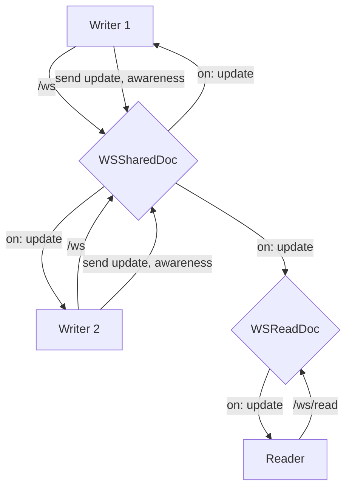
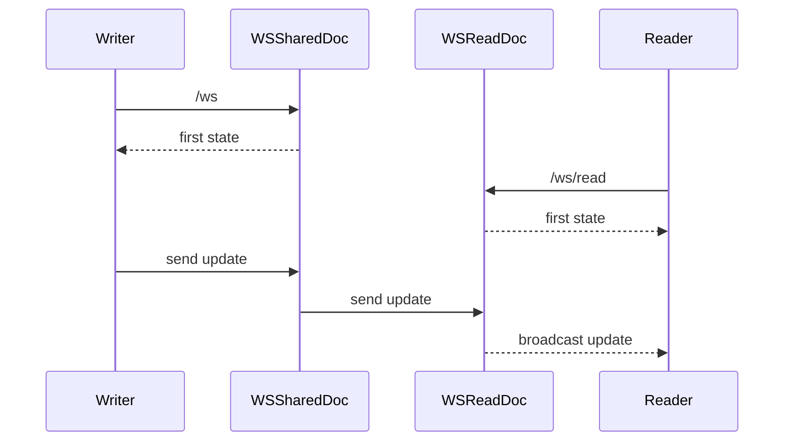
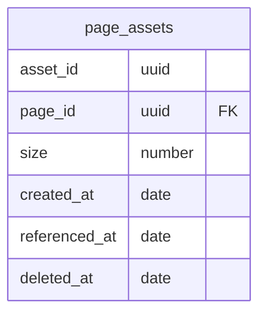
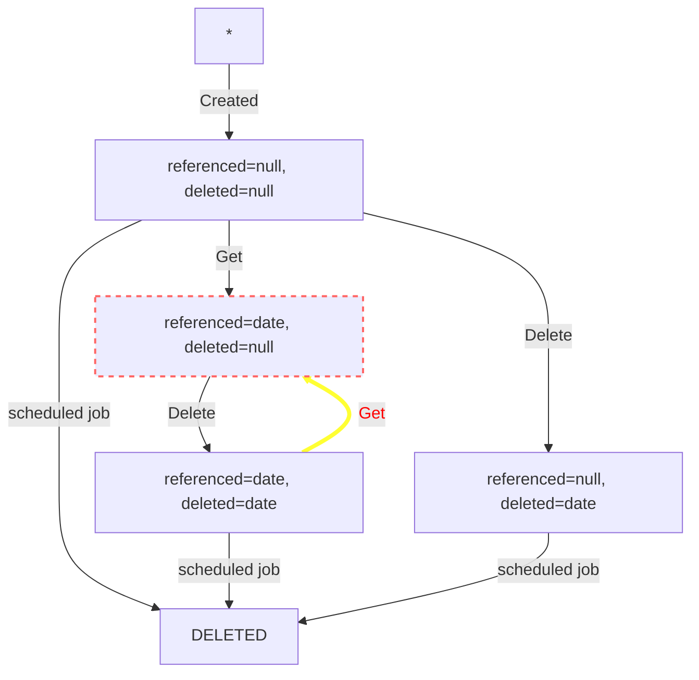
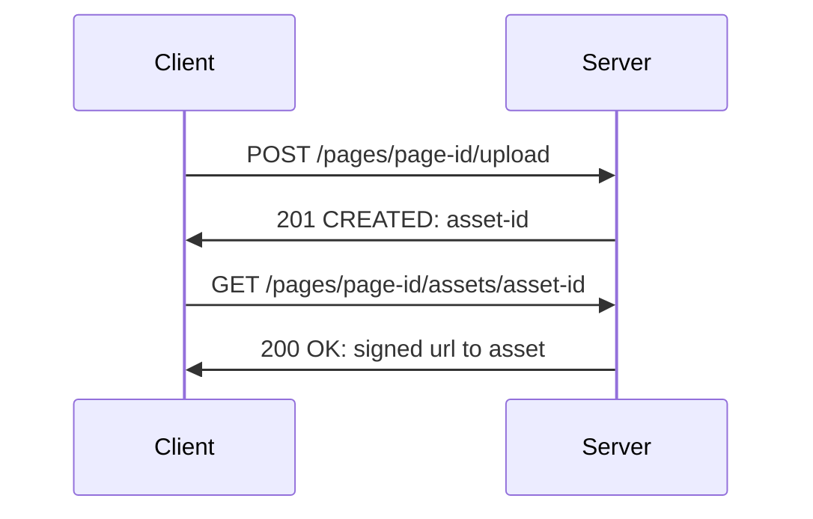

# Pages

## Collaboration

Collaboration is handled by [yjs.js](https://docs.yjs.dev/).

The server files take their sources from this [example repository](https://github.com/yjs/y-websocket-server/).

The yjs's updates are saved in `page_update` and merged (given an update count threshold) to prevent storing too much data.

`page_update` is agnostic of the data `update` it contains.

### Permission Levels

There are 2 websockets connection endpoints:

- `items/pages/:id/ws/read`: For read access, the websocket allows to receive updates for this page. It can be connected to if signed out and the item is public. It does not handle awareness.
- `items/pages/:id/ws`: For write access, the websocket allows to receive updates and to send updates.

## Assets

A page can contain files (ie. images, videos, documents, etc), that we will call assets. The challenges are storage and reference to these assets given a page content.

**page_assets**

- asset_id: uuid, not unique
- page_id: uuid, foreign on item id (page), delete cascade
- size: number
- created_at: date (default: now())
- referenced_at: date (default: null)
- deleted_at: date (default: null, null if not deleted)

Each asset should not be bigger than 1GB.

For a row in this table, the related asset will be stored under `pages/<page-id>`. This will be easier for deletion. For copy purposes, we allow the `id` to be non-unique. However, [page_id, asset_id] must be unique (and indexed).

On access, an asset get `deleted_at` cleared and set `referenced_at=now`.

On upload, a row is created with a generated <asset-id> and the asset is stored at `pages/<page-id>/<asset-id>`. The client is expected to wait for the request, to reference the asset with given `<asset-id>`.
A possible edge case: an upload is actually successful but is never used (ie. the uploaded asset isn't integrated in the corresponding page) and end in state (`deleted_at = null` && `referenced_at != null`). We rely on cleaning solutions (see more below).

A deleted asset will be marked by `deleted_at`. This allows for the history mechanism to still function. If an asset is accessed again, the `deleted_at` property is cleared. An edge case (race condition where someone accesses the asset after it has been deleted): a deleted asset is not marked and remains in the storage (state (`deleted_at = null` && `referenced_at != null`)). We rely on cleaning solutions (see more below).

On page copy, the related rows (`deleted_at = null` && `referenced_at != null`) are copied and the folder `pages/<page-id>` is duplicated and renamed `pages/<copy-id>`.

### Cleaning solutions

- Delete assets where `created_at` is older than 7 days and `referenced_at=null` by a scheduled job.
- Delete assets where `deleted_at` is older than 7 days by a scheduled job.
- If a page is deleted, we delete it's corresponding assets folder and related `page_assets` rows (only way to delete assets with `referenced` not null and `deleted_at` null).
- Possible solution: Endpoint optimization: that send all asset ids and remove non existant assets

### User Storage

A hard limit is set to 10GB. It becomes impossible to upload assets above this limit. We expect majority of pages to be less than 5GB, so there are some margin for inconsistent data.

Inconsistences might happen for assets where `deleted_at = null` and `referenced != null` but actually not being used anymore, because the user won't be able to delete them himself (unless deleting the page). Alternative solution would be to provide a gallery to manage related assets.

### Endpoints

- POST `/pages/<page-id>/upload`: store asset (form-data), if the user has write access to page-id
- GET `/pages/<page-id>/<asset-id>`: get signed url to asset by id, if the asset is comes from page-id and user has read access to page-id, and clear `deleted_at`
- DELETE `/pages/<page-id>/<asset-id>`: mark asset as deleted

## Tests

Controller tests use [`y-websocket`](https://github.com/yjs/y-websocket) to connect to the websocket endpoint. This allows to simulate a change in a yjs document to be reflected in the server.
