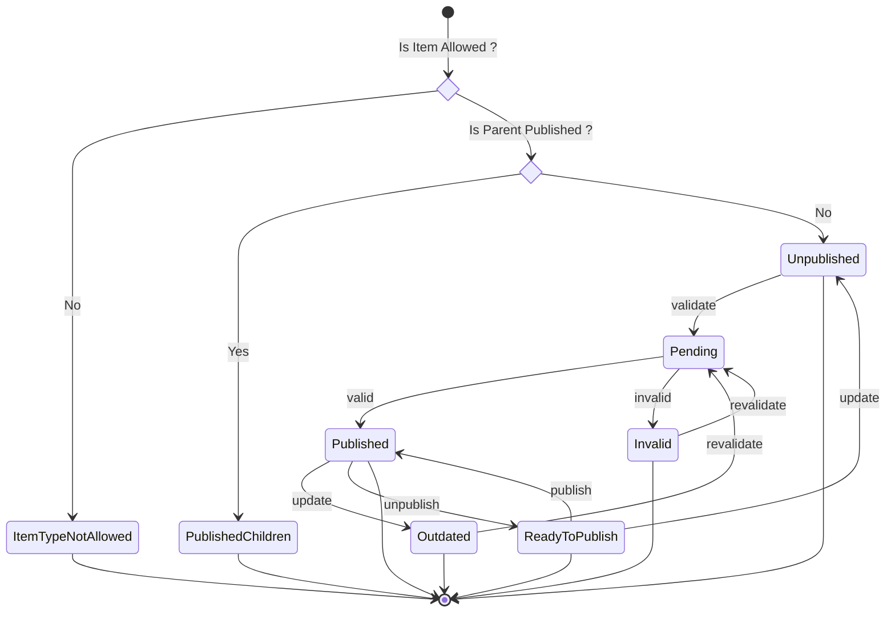

# Publication Process

This document outlines the publication process for items, covering all relevant services (Publication, Published and Validation services).

## Publication Service

The `PublicationService` computes the current publication status of an item. This information is crucial for other services to determine appropriate actions, such as rejecting queries or returning status details.

This service uses the `Item`, `ItemVisibility`, `ItemValidationGroup` and `ItemPublished` entities to compute the `PublicationStatus` (item's state), defined in the SDK, for each item. That means the `PublicationService` doesn't store anything new in the database (it doesn't have a dedicated Entity). Indeed, `ItemVisibility` determines public visibility, `ItemValidationGroup` indicates validation requirements, and `ItemPublished` defines the item's publication state, which collectively influence the final PublicationStatus.

Below is a description of the possible statuses:

- **PublishedChildren**: The item is a child of a published parent, and its publication is managed through the parent.
  > [!WARNING]
  > Preventing children publication when the parent is already published, is currently implemented only in the frontend.
- **ItemTypeNotAllowed**: The item's type cannot be published.
  - Only folders are allowed to be published.
- **Unpublished**: The item is not yet published.
  - This is the default state for new items.
  - Validation is required before publication.
- **Outdated**: The item is currently published but has been updated, requiring the item to ve validated again.
  - Outdated items remain published despite being outdated.
- **Invalid**: The item contains invalid content and has been rejected.
- **Pending**: The item's validation is in progress.
  - Successful validation transitions the item to `Published`.
  - Invalid validation transitions the item to `Invalid`.
- **Published**: The item is successfully published.
  - Updating the item changes the status to `Outdated`.
  - Unpublishing changes it to `ReadyToPublish`.
- **ReadyToPublish**: The item is unpublished but has passed validation.
  - If not updated, it transitions to `Published`.
  - Updating the item reverts the status to `Unpublished`.

- **Endpoint:** `GET /items/publications/:itemId`
  - **Description:** Gets the status of the item's publication.
  - **Permissions:** Only **admin** members of the item can access this route.
  - **Responses:**
    - `200 OK`: Returns the computed `PublicationStatus`.
    - `401 Not Authorized`: If the user is not authenticated.
    - `403 Forbidden`: If the user is not administrator of the item.
    - `404 Not Found`: If the item is not found.

## Validation service

The `ItemValidationService` allows to validate an item or to retrieve an item's validation. This service is crucial to ensure that an item is validated before publishing it.

- **Endpoint:** `POST /items/:itemId/validations`
  - **Description:** Validates the item's content.
  - **Permissions:** Only **admin** members of the item can access this route.
  - **Behavior:**
    - Validation is asynchronous. Websocket feedbacks are sent to the frontend (`ItemOpFeedbackEvent('validate', [itemId], { [item.id]: item })`).
    - Successful validation automatically publishes the item (the publication state become `Published`).
    - Private items become public.
  - **Responses:**
    - `202 Accepted`: Validation process started successfully.
    - `401 Not Authorized`: If the user is not authenticated.
    - `403 Forbidden`: If the user is not administrator of the item.
    - `404 Not Found`: If the item is not found.

## Publish service

The `ItemPublishedService` manages the item's publications. An item should be validated to be published.

- **Endpoint:** `POST /items/:itemId/collections`
  - **Description:** Publishes the item.
  - **Permissions:** Only **admin** members of the item can access this route.
  - **Behavior:** - If the item is valid, the publication state become `Published`. - If it's a valid parent, all its children become `PublishedChildren`. - That means the children cannot be published. - The publication can only be managed by the parent.
    > [!WARNING]
    > If a child is already published, it's still published as a single item.
  - **Responses:**
    - `200 OK`: Item successfully published.
    - `400 Bad Request`: If the item cannot be published (missing validation, invalid item type, not public...).
    - `401 Not Authorized`: If the user is not authenticated.
    - `403 Forbidden`: If the user is not administrator of the item.
    - `404 Not Found`: If the item is not found.
- **Endpoint:** `DELETE /items/:itemId/collections`
  - **Description:** Unpublishes the item.
  - **Permissions:** Only **admin** members of the item can access this route.
  - **Behavior:**
    - Unpublish the item.
    - The state become `ReadyToPublish`. Note that if the item is updated after being unpublished, it's state will be `Unpublished`.
  - **Responses:**
    - `200 OK`: Item successfully unpublished.
    - `401 Not Authorized`: If the user is not authenticated.
    - `403 Forbidden`: If the user is not administrator of the item.
    - `404 Not Found`: If the item is not found or not published.
